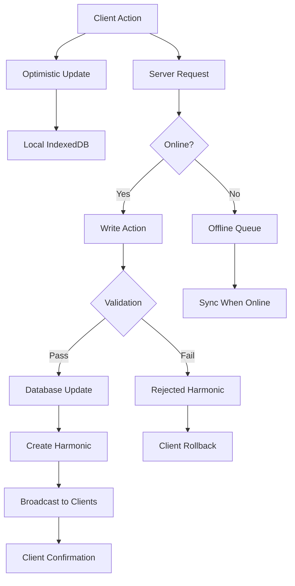
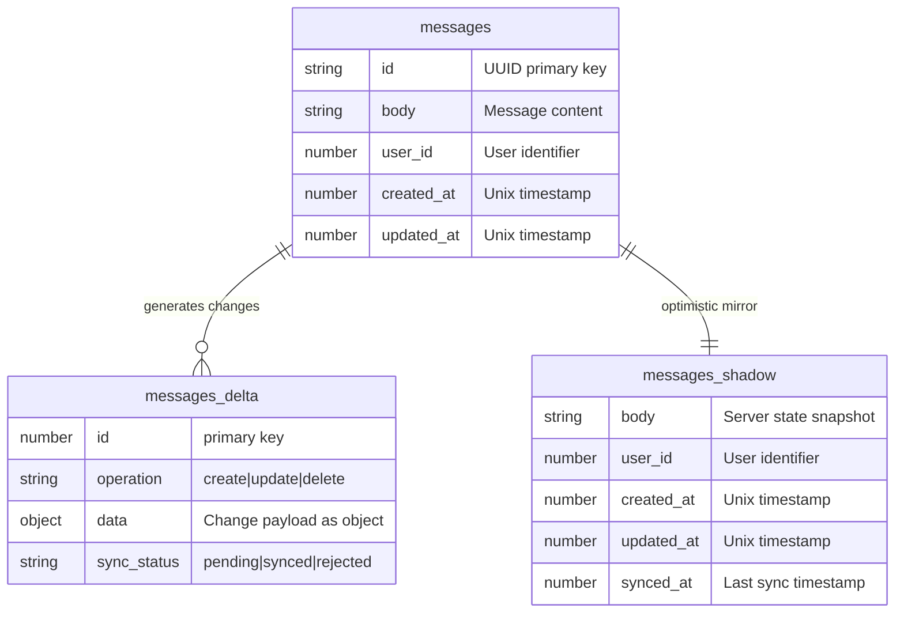

# Write Path

The **write path** in Laravel Chorus handles how client-side changes are processed, validated, and synchronized back to the server. This system enables optimistic updates, offline support, and robust conflict resolution.

## Write Path Overview



## Write Actions

Write Actions are server-side classes that handle client write operations with validation, authorization, and business logic.

### Basic Write Action

```php
<?php

namespace App\Actions\WriteActions;

use App\Models\Message;
use Illuminate\Http\Request;
use Pixelsprout\LaravelChorus\Support\WriteAction;

class CreateMessageAction extends WriteAction
{
    protected array $config = [
        'allowOfflineWrites' => true,
        'supportsBatch' => false,
    ];

    public function handle(Request $request, array $data): Message
    {
        // Validate user permissions
        $this->authorize('create', Message::class);

        // Process the data
        $message = Message::create([
            'id' => $data['id'] ?? Str::uuid(),
            'body' => $data['body'],
            'user_id' => auth()->id(),
            'platform_id' => $data['platform_id'],
            'tenant_id' => auth()->user()->tenant_id,
        ]);

        return $message;
    }

    public function rules(): array
    {
        return [
            'body' => 'required|string|max:1000',
            'platform_id' => 'required|uuid|exists:platforms,id',
            'id' => 'nullable|uuid',
        ];
    }
    
    protected function authorize(string $ability, $model): void
    {
        if (!auth()->user()->can($ability, $model)) {
            throw new UnauthorizedException("Unauthorized to {$ability} messages");
        }
    }
}
```

### Update Write Action

```php
<?php

namespace App\Actions\WriteActions;

use App\Models\Message;
use Illuminate\Http\Request;
use Pixelsprout\LaravelChorus\Support\WriteAction;

class UpdateMessageAction extends WriteAction
{
    protected array $config = [
        'allowOfflineWrites' => true,
        'supportsBatch' => false,
    ];

    public function handle(Request $request, array $data): Message
    {
        $message = Message::findOrFail($data['id']);
        
        // Authorization check
        $this->authorize('update', $message);
        
        // Optimistic locking check
        if (isset($data['updated_at'])) {
            $expectedUpdatedAt = Carbon::parse($data['updated_at']);
            if ($message->updated_at->gt($expectedUpdatedAt)) {
                throw new ConflictException('Message was updated by another user');
            }
        }
        
        // Update only allowed fields
        $message->update([
            'body' => $data['body'],
            'is_edited' => true,
            'edited_at' => now(),
        ]);
        
        return $message->fresh();
    }

    public function rules(): array
    {
        return [
            'id' => 'required|uuid|exists:messages,id',
            'body' => 'required|string|max:1000',
            'updated_at' => 'nullable|date',
        ];
    }
    
    protected function authorize(string $ability, $model): void
    {
        if (!auth()->user()->can($ability, $model)) {
            throw new UnauthorizedException("Unauthorized to {$ability} this message");
        }
    }
}
```

### Delete Write Action

```php
<?php

namespace App\Actions\WriteActions;

use App\Models\Message;
use Illuminate\Http\Request;
use Pixelsprout\LaravelChorus\Support\WriteAction;

class DeleteMessageAction extends WriteAction
{
    protected array $config = [
        'allowOfflineWrites' => true,
        'supportsBatch' => true,
    ];

    public function handle(Request $request, array $data): ?Message
    {
        $message = Message::findOrFail($data['id']);
        
        // Authorization check
        $this->authorize('delete', $message);
        
        // Soft delete with audit trail
        $message->update([
            'deleted_by' => auth()->id(),
            'deleted_at' => now(),
        ]);
        
        // Or hard delete
        // $message->delete();
        
        return null; // Indicate record was deleted
    }

    public function rules(): array
    {
        return [
            'id' => 'required|uuid|exists:messages,id',
        ];
    }
    
    protected function authorize(string $ability, $model): void
    {
        if (!auth()->user()->can($ability, $model)) {
            throw new UnauthorizedException("Unauthorized to {$ability} this message");
        }
    }
}
```

## Write Action Configuration

### Action Registration

Register write actions in your model:

```php
class Message extends Model
{
    use Harmonics;
    
    protected $syncFields = [
        'id', 'body', 'user_id', 'platform_id', 'created_at', 'updated_at'
    ];
    
    protected $writeActions = [
        'create' => CreateMessageAction::class,
        'update' => UpdateMessageAction::class,
        'delete' => DeleteMessageAction::class,
    ];
}
```

### Configuration Options

```php
protected array $config = [
    // Allow writes when client is offline
    'allowOfflineWrites' => true,
    
    // Support batch operations
    'supportsBatch' => false,
];
```

## Client-Side Write Operations

### Basic Write Operations

Using the React `useTable` hook:

```tsx
import { useTable } from '@/chorus/react';
import { types, Message } from '@/stores/types';

export default function MessageForm() {
    const { create, update, delete: remove } = useTable<Message>('messages', types);
    
    const handleCreate = async (body: string) => {
        const tempId = crypto.randomUUID();
        
        await create(
            // Optimistic data (immediate UI update)
            {
                id: tempId,
                body,
                user_id: user.id,
                platform_id: currentPlatform.id,
                created_at: new Date(),
                updated_at: new Date(),
            },
            // Server data (sent to write action)
            {
                body,
                platform_id: currentPlatform.id,
            },
            // Success/Rejected callback
            (serverData) => {
                console.log('Message created successfully:', serverData);
            },
        );
    };
    
    const handleUpdate = async (message: Message, newBody: string) => {
        await update(
            message.id,
            // Optimistic update
            {
                ...message,
                body: newBody,
                is_edited: true,
                updated_at: new Date(),
            },
            // Server update
            {
                id: message.id,
                body: newBody,
                updated_at: message.updated_at, // For optimistic locking
            }
        );
    };
    
    const handleDelete = async (message: Message) => {
        if (!confirm('Delete this message?')) return;
        
        await remove(message.id);
    };
    
    return (
        <form onSubmit={(e) => {
            e.preventDefault();
            const formData = new FormData(e.target);
            handleCreate(formData.get('body'));
        }}>
            <textarea name="body" required />
            <button type="submit">Send Message</button>
        </form>
    );
}
```

## Shadow and Delta Tables

For complex offline synchronization, Chorus can use shadow tables to track local changes.

### Shadow Table Concept

Shadow tables store a copy of the server data, allowing detection of both local and server changes:



## Next Steps

<CardGroup cols={2}>
<Card title="Advanced Features" href="/advanced/channel-prefixes" icon="gear">
Explore advanced configuration and multi-tenancy
</Card>

<Card title="React Integration" href="/integrations/react" icon="react">
Use write actions in your React components
</Card>
</CardGroup>

---

The write path is where Laravel Chorus shines, providing robust offline support, conflict resolution, and validation while maintaining instant user experiences through optimistic updates.