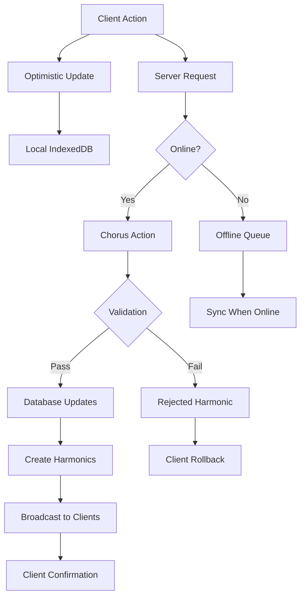
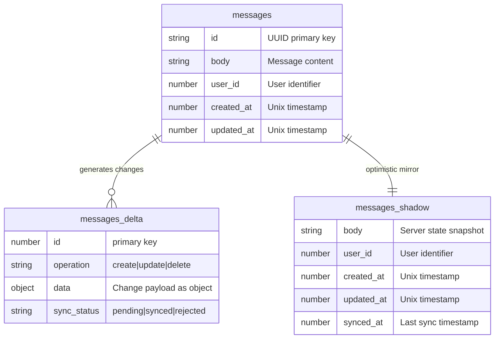

# Write Path

The **write path** in Laravel Chorus handles how client-side changes are processed, validated, and synchronized back to the server. This system enables optimistic updates, offline support, and robust conflict resolution.

## Write Path Overview



## Chorus Actions

Chorus Actions are server-side classes that handle client write operations with validation, authorization, and business logic. They can execute multiple database operations in a single transaction.

### Basic Chorus Action

```php
<?php

namespace App\Actions\ChorusActions;

use App\Models\Message;
use App\Models\User;
use App\Models\Platform;
use Illuminate\Http\Request;
use Pixelsprout\LaravelChorus\Support\ChorusAction;
use Pixelsprout\LaravelChorus\Support\ActionCollector;

class CreateMessageWithActivityAction extends ChorusAction
{
    protected array $config = [
        'allowOfflineWrites' => true,
    ];

    protected function execute(Request $request, ActionCollector $actions): void
    {
        // Authorization check
        $this->authorize('create', Message::class);

        // Execute multiple operations in a single transaction
        $actions->messages->create([
            'id' => $request->input('id') ?? Str::uuid(),
            'body' => $request->input('body'),
            'user_id' => auth()->id(),
            'platform_id' => $request->input('platform_id'),
            'tenant_id' => auth()->user()->tenant_id,
        ]);

        // Update user activity
        $actions->users->update([
            'id' => auth()->id(),
            'last_activity_at' => now(),
        ]);

        // Update platform metrics
        $actions->platforms->update([
            'id' => $request->input('platform_id'),
            'last_message_at' => now(),
            'message_count' => \DB::raw('message_count + 1'),
        ]);
    }

    public function rules(): array
    {
        return [
            'body' => 'required|string|max:1000',
            'platform_id' => 'required|uuid|exists:platforms,id',
            'id' => 'nullable|uuid',
        ];
    }
    
    protected function authorize(string $ability, $model): void
    {
        if (!auth()->user()->can($ability, $model)) {
            throw new UnauthorizedException("Unauthorized to {$ability} messages");
        }
    }
}
```

### Simple Update Action

```php
<?php

namespace App\Actions\ChorusActions;

use App\Models\Message;
use Illuminate\Http\Request;
use Pixelsprout\LaravelChorus\Support\ChorusAction;
use Pixelsprout\LaravelChorus\Support\ActionCollector;

class UpdateMessageAction extends ChorusAction
{
    protected array $config = [
        'allowOfflineWrites' => true,
    ];

    protected function execute(Request $request, ActionCollector $actions): void
    {
        $messageId = $request->input('id');
        $message = Message::findOrFail($messageId);
        
        // Authorization check
        $this->authorize('update', $message);
        
        // Optimistic locking check
        if ($request->has('updated_at')) {
            $expectedUpdatedAt = Carbon::parse($request->input('updated_at'));
            if ($message->updated_at->gt($expectedUpdatedAt)) {
                throw new ConflictException('Message was updated by another user');
            }
        }
        
        // Update the message
        $actions->messages->update([
            'id' => $messageId,
            'body' => $request->input('body'),
            'is_edited' => true,
            'edited_at' => now(),
        ]);
        
        // Update user activity
        $actions->users->update([
            'id' => auth()->id(),
            'last_activity_at' => now(),
        ]);
    }

    public function rules(): array
    {
        return [
            'id' => 'required|uuid|exists:messages,id',
            'body' => 'required|string|max:1000',
            'updated_at' => 'nullable|date',
        ];
    }
    
    protected function authorize(string $ability, $model): void
    {
        if (!auth()->user()->can($ability, $model)) {
            throw new UnauthorizedException("Unauthorized to {$ability} this message");
        }
    }
}
```

### Delete Action

```php
<?php

namespace App\Actions\ChorusActions;

use App\Models\Message;
use Illuminate\Http\Request;
use Pixelsprout\LaravelChorus\Support\ChorusAction;
use Pixelsprout\LaravelChorus\Support\ActionCollector;

class DeleteMessageAction extends ChorusAction
{
    protected array $config = [
        'allowOfflineWrites' => true,
    ];

    protected function execute(Request $request, ActionCollector $actions): void
    {
        $messageId = $request->input('id');
        $message = Message::findOrFail($messageId);
        
        // Authorization check
        $this->authorize('delete', $message);
        
        // Delete the message
        $actions->messages->delete($messageId);
        
        // Update platform message count
        $actions->platforms->update([
            'id' => $message->platform_id,
            'message_count' => \DB::raw('message_count - 1'),
        ]);
        
        // Update user activity
        $actions->users->update([
            'id' => auth()->id(),
            'last_activity_at' => now(),
        ]);
    }

    public function rules(): array
    {
        return [
            'id' => 'required|uuid|exists:messages,id',
        ];
    }
    
    protected function authorize(string $ability, $model): void
    {
        if (!auth()->user()->can($ability, $model)) {
            throw new UnauthorizedException("Unauthorized to {$ability} this message");
        }
    }
}
```

## Chorus Action Configuration

### Action Registration

Register Chorus Actions in your routes:

```php
// routes/chorus.php
use App\Actions\ChorusActions\CreateMessageWithActivityAction;
use App\Actions\ChorusActions\UpdateMessageAction;
use App\Actions\ChorusActions\DeleteMessageAction;

Route::chorus('create-message-with-activity', CreateMessageWithActivityAction::class);
Route::chorus('update-message', UpdateMessageAction::class);
Route::chorus('delete-message', DeleteMessageAction::class);
```

### Configuration Options

```php
protected array $config = [
    // Allow writes when client is offline
    'allowOfflineWrites' => true,
];
```

## Client-Side Chorus Actions

### Using Generated Action Functions

Chorus generates TypeScript functions for each registered action:

```tsx
import { createMessageWithActivityAction, updateMessageAction, deleteMessageAction } from '@/_generated/chorus-actions';
import { uuidv7 } from 'uuidv7';

export default function MessageForm() {
    const handleCreate = async (body: string, platformId: string) => {
        const messageId = uuidv7();
        
        const result = await createMessageWithActivityAction((writes) => {
            // Create the message
            writes.messages.create({
                id: messageId,
                body,
                platform_id: platformId,
                user_id: user.id,
                tenant_id: user.tenant_id,
            });
            
            // Update user activity (handled automatically)
            writes.users.update({
                id: user.id,
                last_activity_at: new Date().toISOString(),
            });
            
            // Update platform metrics (handled automatically)
            writes.platforms.update({
                id: platformId,
                last_message_at: new Date().toISOString(),
            });
        });
        
        if (result.success) {
            console.log('Message created successfully:', result);
        } else {
            console.error('Message creation failed:', result.error);
        }
    };
    
    const handleUpdate = async (messageId: string, newBody: string) => {
        await updateMessageAction((writes) => {
            writes.messages.update({
                id: messageId,
                body: newBody,
            });
        });
    };
    
    const handleDelete = async (messageId: string) => {
        if (!confirm('Delete this message?')) return;
        
        await deleteMessageAction((writes) => {
            writes.messages.delete(messageId);
        });
    };
    
    return (
        <form onSubmit={(e) => {
            e.preventDefault();
            const formData = new FormData(e.target);
            handleCreate(formData.get('body'), formData.get('platform_id'));
        }}>
            <textarea name="body" required />
            <select name="platform_id" required>
                <option value="">Select Platform</option>
                {/* Platform options */}
            </select>
            <button type="submit">Send Message</button>
        </form>
    );
}
```

## Shadow and Delta Tables

For complex offline synchronization, Chorus can use shadow tables to track local changes.

### Shadow Table Concept

Shadow tables store a copy of the server data, allowing detection of both local and server changes:



## Next Steps

<CardGroup cols={2}>
<Card title="Advanced Features" href="/advanced/channel-prefixes" icon="gear">
Explore advanced configuration and multi-tenancy
</Card>

<Card title="React Integration" href="/integrations/react" icon="react">
Use Chorus Actions in your React components
</Card>
</CardGroup>

---

The write path is where Laravel Chorus shines, providing robust offline support, conflict resolution, and validation while maintaining instant user experiences through optimistic updates. With Chorus Actions, you can execute multiple operations atomically in a single transaction.