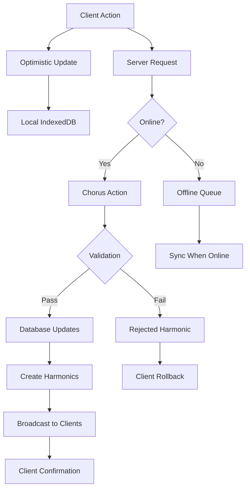
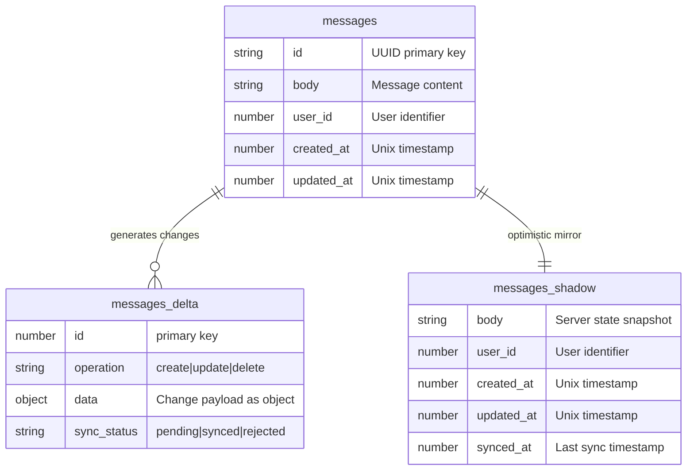

# Write Path

The **write path** in Laravel Chorus handles how client-side changes are processed, validated, and synchronized back to the server. This system enables optimistic updates, offline support, and robust conflict resolution.

## Write Path Overview



## Chorus Actions

Chorus Actions are server-side classes that handle client write operations with validation, authorization, and business logic. They can execute multiple database operations in a single transaction.

### Basic Chorus Action

```php
<?php

namespace App\Actions\ChorusActions;

use App\Models\Message;
use App\Models\User;
use App\Models\Platform;
use Illuminate\Http\Request;
use Pixelsprout\LaravelChorus\Support\ChorusAction;
final class CreateMessageWithActivityAction extends ChorusAction
{
    public function rules(): array
    {
        return [
            'messages.create' => [
                'id' => 'nullable|uuid',
                'body' => 'required|string|max:1000',
                'platform_id' => 'required|uuid|exists:platforms,id',
                'user_id' => 'required|uuid|exists:users,id',
                'tenant_id' => 'required|uuid',
            ],
            'users.update' => [
                'id' => 'required|uuid|exists:users,id',
                'last_activity_at' => 'required|date',
            ],
            'platforms.update' => [
                'id' => 'required|uuid|exists:platforms,id',
                'last_message_at' => 'nullable|date',
                'message_count' => 'nullable|numeric',
            ],
        ];
    }

    public function handle(Request $request): void
    {
        // Authorization check
        $this->authorize('create', Message::class);

        $user = auth()->user();

        // Get message create operations
        $messageCreateOperations = $this->getOperations('messages', 'create');
        
        foreach ($messageCreateOperations as $messageData) {
            Message::create([
                'id' => $messageData['id'] ?? Str::uuid(),
                'body' => $messageData['body'],
                'user_id' => $user->id,
                'platform_id' => $messageData['platform_id'],
                'tenant_id' => $user->tenant_id,
            ]);
        }

        // Update user activity
        User::where('id', $user->id)->update([
            'last_activity_at' => now(),
        ]);

        // Get platform update operations
        $platformUpdateOperations = $this->getOperations('platforms', 'update');
        
        foreach ($platformUpdateOperations as $platformData) {
            Platform::where('id', $platformData['id'])->update([
                'last_message_at' => now(),
                'message_count' => \DB::raw('message_count + 1'),
            ]);
        }
    }
    
    protected function authorize(string $ability, $model): void
    {
        if (!auth()->user()->can($ability, $model)) {
            throw new UnauthorizedException("Unauthorized to {$ability} messages");
        }
    }
}
```

### Simple Update Action

```php
<?php

namespace App\Actions\ChorusActions;

use App\Models\Message;
use Illuminate\Http\Request;
use Pixelsprout\LaravelChorus\Support\ChorusAction;
final class UpdateMessageAction extends ChorusAction
{
    public function rules(): array
    {
        return [
            'messages.update' => [
                'id' => 'required|uuid|exists:messages,id',
                'body' => 'required|string|max:1000',
                'updated_at' => 'nullable|date',
            ],
            'users.update' => [
                'id' => 'required|uuid|exists:users,id',
                'last_activity_at' => 'required|date',
            ],
        ];
    }

    public function handle(Request $request): void
    {
        $user = auth()->user();
        
        // Get message update operations
        $messageUpdateOperations = $this->getOperations('messages', 'update');
        
        foreach ($messageUpdateOperations as $messageData) {
            $message = Message::where('id', $messageData['id'])
                ->where('tenant_id', $user->tenant_id)
                ->first();
            
            if (!$message) {
                throw new \Exception('Message not found or unauthorized');
            }
            
            // Authorization check
            $this->authorize('update', $message);
            
            // Optimistic locking check
            if (isset($messageData['updated_at'])) {
                $expectedUpdatedAt = Carbon::parse($messageData['updated_at']);
                if ($message->updated_at->gt($expectedUpdatedAt)) {
                    throw new ConflictException('Message was updated by another user');
                }
            }
            
            // Update the message
            $message->update([
                'body' => $messageData['body'],
                'is_edited' => true,
                'edited_at' => now(),
            ]);
        }
        
        // Update user activity
        User::where('id', $user->id)->update([
            'last_activity_at' => now(),
        ]);
    }
    
    protected function authorize(string $ability, $model): void
    {
        if (!auth()->user()->can($ability, $model)) {
            throw new UnauthorizedException("Unauthorized to {$ability} this message");
        }
    }
}
```

### Delete Action

```php
<?php

namespace App\Actions\ChorusActions;

use App\Models\Message;
use Illuminate\Http\Request;
use Pixelsprout\LaravelChorus\Support\ChorusAction;
final class DeleteMessageAction extends ChorusAction
{
    public function rules(): array
    {
        return [
            'id' => 'required|string|uuid',
        ];
    }

    public function handle(Request $request): void
    {
        $user = auth()->user();

        if (!$user) {
            throw new \Exception('User must be authenticated');
        }

        // Get message delete operations
        $messageDeleteOperations = $this->getOperations('messages', 'delete');
        
        foreach ($messageDeleteOperations as $messageData) {
            $message = Message::where('id', $messageData['id'])
                ->where('tenant_id', $user->tenant_id)
                ->first();

            if (!$message) {
                throw new \Exception('Message not found or unauthorized');
            }
            
            // Authorization check
            $this->authorize('delete', $message);
            
            // Delete the message
            $message->delete();
        }

        // Update user's last activity timestamp
        User::where('id', $user->id)->update([
            'last_activity_at' => now(),
        ]);
    }
    
    protected function authorize(string $ability, $model): void
    {
        if (!auth()->user()->can($ability, $model)) {
            throw new UnauthorizedException("Unauthorized to {$ability} this message");
        }
    }
}
```

## Chorus Action Configuration

### Action Registration

Register Chorus Actions in your routes:

```php
// routes/chorus.php
use App\Actions\ChorusActions\CreateMessageWithActivityAction;
use App\Actions\ChorusActions\UpdateMessageAction;
use App\Actions\ChorusActions\DeleteMessageAction;

Route::chorus('create-message-with-activity', CreateMessageWithActivityAction::class);
Route::chorus('update-message', UpdateMessageAction::class);
Route::chorus('delete-message', DeleteMessageAction::class);
```

### Automatic Features

All Chorus Actions automatically support:
- **Offline writes** - Operations are queued when offline and synced when reconnected
- **Batch operations** - Multiple items can be processed in a single request
- **Optimistic updates** - UI updates immediately while server processes in background

## Single Operation Shorthand

For actions with only one operation rule, you can use a simplified data format:

```php
// Single operation action
final class SimpleCreateMessageAction extends ChorusAction
{
    public function rules(): array
    {
        return [
            'messages.create' => [
                'body' => 'required|string|max:1000',
                'platform_id' => 'required|uuid|exists:platforms,id',
            ],
        ];
    }

    public function handle(Request $request): void
    {
        $user = auth()->user();
        
        // Get message create operations
        $messageCreateOperations = $this->getOperations('messages', 'create');
        
        foreach ($messageCreateOperations as $messageData) {
            Message::create([
                'id' => $messageData['id'] ?? Str::uuid(),
                'body' => $messageData['body'],
                'platform_id' => $messageData['platform_id'],
                'user_id' => $user->id,
            ]);
        }
    }
}
```

**Client-side usage:**

```typescript
// Full format (always works) - UUID auto-generated
await createMessageAction(({ create }) => {
    create('messages', {
        body: "Hello world",
        platform_id: "abc-123"
    });
});

// Shorthand format (single operation only) - UUID auto-generated
await createMessageAction({
    body: "Hello world", 
    platform_id: "abc-123"
});
```

## Client-Side Chorus Actions

### Using Generated Action Functions

Chorus generates TypeScript functions for each registered action:

```tsx
import { createMessageWithActivityAction, updateMessageAction, deleteMessageAction } from '@/_generated/chorus-actions';

export default function MessageForm() {
    const handleCreate = async (body: string, platformId: string) => {        
        const result = await createMessageWithActivityAction(({ create, update }) => {
            // Create the message (UUID auto-generated)
            create('messages', {
                body,
                platform_id: platformId,
                user_id: user.id,
                tenant_id: user.tenant_id,
            });
            
            // Update user activity (handled automatically)
            update('users', {
                id: user.id,
                last_activity_at: new Date().toISOString(),
            });
            
            // Update platform metrics (handled automatically)
            update('platforms', {
                id: platformId,
                last_message_at: new Date().toISOString(),
            });
        });
        
        if (result.success) {
            console.log('Message created successfully:', result);
        } else {
            console.error('Message creation failed:', result.error);
        }
    };
    
    const handleUpdate = async (messageId: string, newBody: string) => {
        await updateMessageAction(({ update }) => {
            update('messages', {
                id: messageId,
                body: newBody,
            });
        });
    };
    
    const handleDelete = async (messageId: string) => {
        if (!confirm('Delete this message?')) return;
        
        await deleteMessageAction(({ remove, update }) => {
            remove('messages', {
                id: messageId,
            });
            
            // Update user activity
            update('users', {
                id: user.id,
                last_activity_at: new Date().toISOString(),
            });
        });
    };
    
    return (
        <form onSubmit={(e) => {
            e.preventDefault();
            const formData = new FormData(e.target);
            handleCreate(formData.get('body'), formData.get('platform_id'));
        }}>
            <textarea name="body" required />
            <select name="platform_id" required>
                <option value="">Select Platform</option>
                {/* Platform options */}
            </select>
            <button type="submit">Send Message</button>
        </form>
    );
}
```

## Shadow and Delta Tables

For complex offline synchronization, Chorus can use shadow tables to track local changes.

### Shadow Table Concept

Shadow tables store a copy of the server data, allowing detection of both local and server changes:



## Next Steps

<CardGroup cols={2}>
<Card title="Advanced Features" href="/advanced/channel-prefixes" icon="gear">
Explore advanced configuration and multi-tenancy
</Card>

<Card title="React Integration" href="/integrations/react" icon="react">
Use Chorus Actions in your React components
</Card>
</CardGroup>

---

The write path is where Laravel Chorus shines, providing robust offline support, conflict resolution, and validation while maintaining instant user experiences through optimistic updates. With Chorus Actions, you can execute multiple operations atomically in a single transaction.