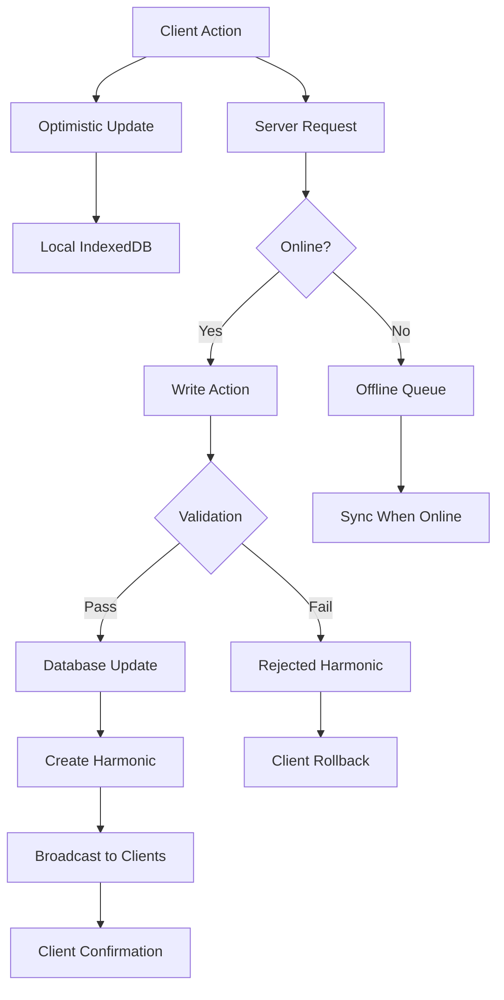

# Write Path

The **write path** in Laravel Chorus handles how client-side changes are processed, validated, and synchronized back to the server. This system enables optimistic updates, offline support, and robust conflict resolution.

## Write Path Overview



## Write Actions

Write Actions are server-side classes that handle client write operations with validation, authorization, and business logic.

### Basic Write Action

```php
<?php

namespace App\Actions\WriteActions;

use App\Models\Message;
use Illuminate\Http\Request;
use Pixelsprout\LaravelChorus\Support\WriteAction;

class CreateMessageAction extends WriteAction
{
    protected array $config = [
        'allowOfflineWrites' => true,
        'supportsBatch' => false,
    ];

    public function handle(Request $request, array $data): Message
    {
        // Validate user permissions
        $this->authorize('create', Message::class);
        
        // Process the data
        $message = Message::create([
            'id' => $data['id'] ?? Str::uuid(),
            'body' => $data['body'],
            'user_id' => auth()->id(),
            'platform_id' => $data['platform_id'],
            'tenant_id' => auth()->user()->tenant_id,
        ]);
        
        // Additional business logic
        $this->notifyMentionedUsers($message);
        
        return $message;
    }

    public function rules(): array
    {
        return [
            'body' => 'required|string|max:1000',
            'platform_id' => 'required|uuid|exists:platforms,id',
            'id' => 'nullable|uuid',
        ];
    }
    
    protected function authorize(string $ability, $model): void
    {
        if (!auth()->user()->can($ability, $model)) {
            throw new UnauthorizedException("Unauthorized to {$ability} messages");
        }
    }
    
    private function notifyMentionedUsers(Message $message): void
    {
        // Extract @mentions and send notifications
        preg_match_all('/@(\w+)/', $message->body, $matches);
        
        foreach ($matches[1] as $username) {
            $user = User::where('username', $username)->first();
            if ($user) {
                $user->notify(new MentionNotification($message));
            }
        }
    }
}
```

### Update Write Action

```php
<?php

namespace App\Actions\WriteActions;

use App\Models\Message;
use Illuminate\Http\Request;
use Pixelsprout\LaravelChorus\Support\WriteAction;

class UpdateMessageAction extends WriteAction
{
    protected array $config = [
        'allowOfflineWrites' => true,
        'supportsBatch' => false,
    ];

    public function handle(Request $request, array $data): Message
    {
        $message = Message::findOrFail($data['id']);
        
        // Authorization check
        $this->authorize('update', $message);
        
        // Optimistic locking check
        if (isset($data['updated_at'])) {
            $expectedUpdatedAt = Carbon::parse($data['updated_at']);
            if ($message->updated_at->gt($expectedUpdatedAt)) {
                throw new ConflictException('Message was updated by another user');
            }
        }
        
        // Update only allowed fields
        $message->update([
            'body' => $data['body'],
            'is_edited' => true,
            'edited_at' => now(),
        ]);
        
        return $message->fresh();
    }

    public function rules(): array
    {
        return [
            'id' => 'required|uuid|exists:messages,id',
            'body' => 'required|string|max:1000',
            'updated_at' => 'nullable|date',
        ];
    }
    
    protected function authorize(string $ability, $model): void
    {
        if (!auth()->user()->can($ability, $model)) {
            throw new UnauthorizedException("Unauthorized to {$ability} this message");
        }
    }
}
```

### Delete Write Action

```php
<?php

namespace App\Actions\WriteActions;

use App\Models\Message;
use Illuminate\Http\Request;
use Pixelsprout\LaravelChorus\Support\WriteAction;

class DeleteMessageAction extends WriteAction
{
    protected array $config = [
        'allowOfflineWrites' => true,
        'supportsBatch' => true,
    ];

    public function handle(Request $request, array $data): ?Message
    {
        $message = Message::findOrFail($data['id']);
        
        // Authorization check
        $this->authorize('delete', $message);
        
        // Soft delete with audit trail
        $message->update([
            'deleted_by' => auth()->id(),
            'deleted_at' => now(),
        ]);
        
        // Or hard delete
        // $message->delete();
        
        return null; // Indicate record was deleted
    }

    public function rules(): array
    {
        return [
            'id' => 'required|uuid|exists:messages,id',
        ];
    }
    
    protected function authorize(string $ability, $model): void
    {
        if (!auth()->user()->can($ability, $model)) {
            throw new UnauthorizedException("Unauthorized to {$ability} this message");
        }
    }
}
```

## Write Action Configuration

### Action Registration

Register write actions in your model:

```php
class Message extends Model
{
    use Harmonics;
    
    protected $syncFields = [
        'id', 'body', 'user_id', 'platform_id', 'created_at', 'updated_at'
    ];
    
    protected $writeActions = [
        'create' => CreateMessageAction::class,
        'update' => UpdateMessageAction::class,
        'delete' => DeleteMessageAction::class,
        
        // Advanced configurations
        'batch-create' => [
            'class' => BatchCreateMessageAction::class,
            'config' => [
                'max_batch_size' => 50,
                'timeout' => 30,
            ]
        ],
    ];
}
```

### Configuration Options

```php
protected array $config = [
    // Allow writes when client is offline
    'allowOfflineWrites' => true,
    
    // Support batch operations
    'supportsBatch' => false,
    
    // Maximum execution time (seconds)
    'timeout' => 30,
    
    // Retry failed operations
    'retryOnFailure' => true,
    'maxRetries' => 3,
    
    // Rate limiting
    'rateLimit' => [
        'maxAttempts' => 10,
        'decayMinutes' => 1,
    ],
    
    // Custom validation
    'validateSchema' => true,
    'requireAuth' => true,
];
```

## Client-Side Write Operations

### Basic Write Operations

Using the React `useTable` hook:

```tsx
import { useTable } from '@/chorus/react';
import { types, Message } from '@/stores/types';

export default function MessageForm() {
    const { create, update, delete: remove } = useTable<Message>('messages', types);
    
    const handleCreate = async (body: string) => {
        const tempId = crypto.randomUUID();
        
        await create(
            // Optimistic data (immediate UI update)
            {
                id: tempId,
                body,
                user_id: user.id,
                platform_id: currentPlatform.id,
                created_at: new Date(),
                updated_at: new Date(),
            },
            // Server data (sent to write action)
            {
                body,
                platform_id: currentPlatform.id,
            },
            // Success callback
            (serverData) => {
                console.log('Message created successfully:', serverData);
            },
            // Error callback (triggers rollback)
            (error) => {
                console.error('Failed to create message:', error);
                alert(`Failed to send message: ${error.message}`);
            }
        );
    };
    
    const handleUpdate = async (message: Message, newBody: string) => {
        await update(
            message.id,
            // Optimistic update
            {
                ...message,
                body: newBody,
                is_edited: true,
                updated_at: new Date(),
            },
            // Server update
            {
                id: message.id,
                body: newBody,
                updated_at: message.updated_at, // For optimistic locking
            }
        );
    };
    
    const handleDelete = async (message: Message) => {
        if (!confirm('Delete this message?')) return;
        
        await remove(message.id);
    };
    
    return (
        <form onSubmit={(e) => {
            e.preventDefault();
            const formData = new FormData(e.target);
            handleCreate(formData.get('body'));
        }}>
            <textarea name="body" required />
            <button type="submit">Send Message</button>
        </form>
    );
}
```

### Advanced Write Operations

Using write actions directly:

```tsx
import { useWriteActions } from '@/chorus/react';

export default function AdvancedMessageActions() {
    const { executeAction, isExecuting, error } = useWriteActions();
    
    const batchCreateMessages = async (messages: string[]) => {
        try {
            const result = await executeAction('messages', 'batch-create', {
                messages: messages.map(body => ({
                    body,
                    platform_id: currentPlatform.id,
                }))
            });
            
            console.log('Batch created:', result);
        } catch (error) {
            console.error('Batch create failed:', error);
        }
    };
    
    const scheduleMessage = async (body: string, scheduledFor: Date) => {
        try {
            const result = await executeAction('messages', 'schedule', {
                body,
                platform_id: currentPlatform.id,
                scheduled_for: scheduledFor.toISOString(),
            });
            
            console.log('Message scheduled:', result);
        } catch (error) {
            console.error('Schedule failed:', error);
        }
    };
    
    return (
        <div>
            <button 
                onClick={() => batchCreateMessages(['Hello', 'World', '!'])}
                disabled={isExecuting}
            >
                Batch Create Messages
            </button>
            
            <button 
                onClick={() => scheduleMessage('Scheduled message', new Date(Date.now() + 3600000))}
                disabled={isExecuting}
            >
                Schedule Message
            </button>
            
            {error && <div className="error">{error}</div>}
        </div>
    );
}
```

## Shadow and Delta Tables

For complex offline synchronization, Chorus can use shadow tables to track local changes.

### Shadow Table Concept

Shadow tables store a copy of the server data, allowing detection of both local and server changes:

```sql
-- Main table (synchronized from server)
CREATE TABLE messages (
    id VARCHAR(36) PRIMARY KEY,
    body TEXT,
    user_id BIGINT,
    created_at TIMESTAMP,
    updated_at TIMESTAMP
);

-- Shadow table (tracks server state)
CREATE TABLE messages_shadow (
    id VARCHAR(36) PRIMARY KEY,
    body TEXT,
    user_id BIGINT,
    created_at TIMESTAMP,
    updated_at TIMESTAMP,
    synced_at TIMESTAMP
);

-- Delta table (tracks local changes)
CREATE TABLE messages_delta (
    id VARCHAR(36) PRIMARY KEY,
    operation ENUM('create', 'update', 'delete'),
    data JSON,
    created_at TIMESTAMP
);
```

### Three-Way Merge

When reconnecting after being offline, Chorus performs a three-way merge:

1. **Server state** - Latest data from server
2. **Shadow state** - What the server looked like when we went offline  
3. **Local state** - Current local data with user changes

```javascript
// Simplified three-way merge algorithm
async function performThreeWayMerge(tableName) {
    const serverData = await fetchFromServer(tableName);
    const shadowData = await types[`${tableName}_shadow`].toArray();
    const localData = await types[tableName].toArray();
    
    for (const serverRecord of serverData) {
        const shadowRecord = shadowData.find(s => s.id === serverRecord.id);
        const localRecord = localData.find(l => l.id === serverRecord.id);
        
        if (!shadowRecord && !localRecord) {
            // New server record - add locally
            await types[tableName].put(serverRecord);
            
        } else if (!shadowRecord && localRecord) {
            // New local record - already exists locally
            continue;
            
        } else if (shadowRecord && !localRecord) {
            // Record deleted locally - keep deleted
            continue;
            
        } else {
            // Record exists in all three - check for conflicts
            const hasServerChanges = !isEqual(serverRecord, shadowRecord);
            const hasLocalChanges = !isEqual(localRecord, shadowRecord);
            
            if (hasServerChanges && hasLocalChanges) {
                // Conflict - apply resolution strategy
                const resolved = await resolveConflict(
                    serverRecord, 
                    localRecord, 
                    shadowRecord
                );
                await types[tableName].put(resolved);
                
            } else if (hasServerChanges) {
                // Server changed - update local
                await types[tableName].put(serverRecord);
                
            } else if (hasLocalChanges) {
                // Local changed - keep local (will sync to server)
                continue;
            }
        }
        
        // Update shadow to new server state
        await types[`${tableName}_shadow`].put(serverRecord);
    }
}
```

## Offline Sync

### Queuing Offline Operations

When offline, write operations are queued for later synchronization:

```javascript
// Offline write queue
class OfflineQueue {
    constructor(database) {
        this.types = database;
    }
    
    async queueOperation(tableName, action, data) {
        await this.types._chorus_queue.add({
            id: crypto.randomUUID(),
            table: tableName,
            action,
            data,
            timestamp: Date.now(),
            attempts: 0,
            status: 'pending'
        });
    }
    
    async processQueue() {
        const queuedOps = await this.types._chorus_queue
            .where('status').equals('pending')
            .orderBy('timestamp')
            .toArray();
            
        for (const op of queuedOps) {
            try {
                await this.executeQueuedOperation(op);
                
                // Mark as completed
                await this.types._chorus_queue.update(op.id, {
                    status: 'completed',
                    completed_at: Date.now()
                });
                
            } catch (error) {
                // Increment attempts and mark as failed if max attempts reached
                const attempts = op.attempts + 1;
                
                if (attempts >= 3) {
                    await this.types._chorus_queue.update(op.id, {
                        status: 'failed',
                        attempts,
                        error: error.message
                    });
                    
                    // Notify user of failed operation
                    this.notifyFailedOperation(op, error);
                } else {
                    await this.types._chorus_queue.update(op.id, {
                        attempts,
                        error: error.message
                    });
                }
            }
        }
    }
    
    async executeQueuedOperation(operation) {
        const response = await fetch(`/chorus/${operation.table}/${operation.action}`, {
            method: 'POST',
            headers: {
                'Content-Type': 'application/json',
                'X-CSRF-TOKEN': document.querySelector('meta[name="csrf-token"]').content
            },
            body: JSON.stringify(operation.data)
        });
        
        if (!response.ok) {
            throw new Error(`Server error: ${response.status}`);
        }
        
        return await response.json();
    }
}
```

### Conflict Resolution Strategies

When conflicts occur between local and server changes:

#### Last-Write-Wins

```javascript
function resolveConflictLastWriteWins(serverRecord, localRecord, shadowRecord) {
    // Use the record with the latest updated_at timestamp
    const serverTime = new Date(serverRecord.updated_at).getTime();
    const localTime = new Date(localRecord.updated_at).getTime();
    
    return serverTime > localTime ? serverRecord : localRecord;
}
```

#### Field-Level Merge

```javascript
function resolveConflictFieldLevel(serverRecord, localRecord, shadowRecord) {
    const resolved = { ...shadowRecord };
    
    // Check each field for changes
    for (const field in serverRecord) {
        const serverChanged = serverRecord[field] !== shadowRecord[field];
        const localChanged = localRecord[field] !== shadowRecord[field];
        
        if (serverChanged && localChanged) {
            // Both changed - prefer local for user-edited fields
            if (['body', 'title', 'content'].includes(field)) {
                resolved[field] = localRecord[field];
            } else {
                resolved[field] = serverRecord[field];
            }
        } else if (serverChanged) {
            resolved[field] = serverRecord[field];
        } else if (localChanged) {
            resolved[field] = localRecord[field];
        }
    }
    
    return resolved;
}
```

#### User-Prompted Resolution

```javascript
async function resolveConflictUserPrompt(serverRecord, localRecord, shadowRecord) {
    return new Promise((resolve) => {
        // Show conflict resolution UI
        const modal = createConflictModal({
            serverVersion: serverRecord,
            localVersion: localRecord,
            onResolve: (resolvedRecord) => {
                modal.close();
                resolve(resolvedRecord);
            }
        });
        
        modal.show();
    });
}
```

## Error Handling and Validation

### Server-Side Validation

Write actions include comprehensive validation:

```php
class CreateMessageAction extends WriteAction
{
    public function rules(): array
    {
        return [
            'body' => 'required|string|max:1000|profanity_filter',
            'platform_id' => 'required|uuid|exists:platforms,id',
            'parent_id' => 'nullable|uuid|exists:messages,id',
            'attachments' => 'nullable|array|max:5',
            'attachments.*' => 'file|max:10240|mimes:jpg,png,gif,pdf',
        ];
    }
    
    public function authorize(Request $request, array $data): bool
    {
        $platform = Platform::find($data['platform_id']);
        
        return $request->user()->can('createMessages', $platform);
    }
    
    protected function afterValidation(Request $request, array $data): array
    {
        // Custom business logic validation
        if ($this->isSpamMessage($data['body'])) {
            throw ValidationException::withMessages([
                'body' => 'Message appears to be spam'
            ]);
        }
        
        // Rate limiting
        if ($this->hasExceededRateLimit($request->user())) {
            throw ValidationException::withMessages([
                'rate_limit' => 'Too many messages sent recently'
            ]);
        }
        
        return $data;
    }
}
```

### Client-Side Error Handling

```tsx
import { useRejectedHarmonics } from '@/chorus/react';

export default function ErrorHandler() {
    const { 
        rejectedOperations, 
        retry, 
        dismiss, 
        dismissAll 
    } = useRejectedHarmonics();
    
    if (rejectedOperations.length === 0) return null;
    
    return (
        <div className="error-panel">
            <h3>Failed Operations</h3>
            {rejectedOperations.map((operation) => (
                <div key={operation.id} className="error-item">
                    <div className="error-details">
                        <strong>{operation.action}</strong> failed
                        <p>{operation.error}</p>
                        
                        {operation.validationErrors && (
                            <ul>
                                {Object.entries(operation.validationErrors).map(([field, errors]) => (
                                    <li key={field}>
                                        <strong>{field}:</strong> {errors.join(', ')}
                                    </li>
                                ))}
                            </ul>
                        )}
                    </div>
                    
                    <div className="error-actions">
                        <button onClick={() => retry(operation.id)}>
                            Retry
                        </button>
                        <button onClick={() => dismiss(operation.id)}>
                            Dismiss
                        </button>
                    </div>
                </div>
            ))}
            
            <button onClick={dismissAll}>Dismiss All</button>
        </div>
    );
}
```

## Next Steps

<CardGroup cols={2}>
<Card title="Advanced Features" href="/advanced/channel-prefixes" icon="gear">
Explore advanced configuration and multi-tenancy
</Card>

<Card title="React Integration" href="/integrations/react" icon="react">
Use write actions in your React components
</Card>
</CardGroup>

---

The write path is where Laravel Chorus shines, providing robust offline support, conflict resolution, and validation while maintaining instant user experiences through optimistic updates.