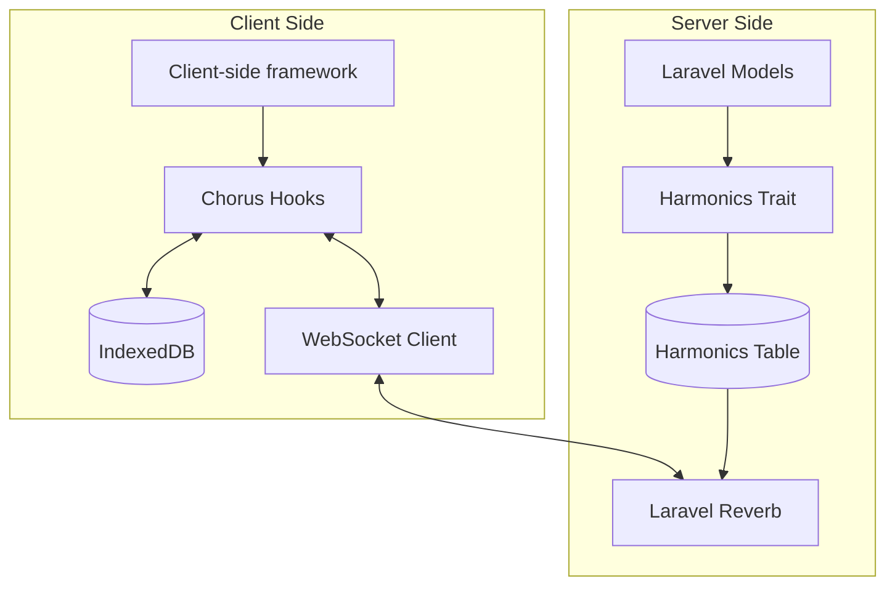

# How Chorus Works

Laravel Chorus creates a **bidirectional synchronization system** between your Laravel backend and client applications. This page explains the core architecture and data flow patterns that make real-time synchronization possible.

## Architecture Overview



## Core Components

### Server-Side Components

<AccordionGroup>
<Accordion title="Harmonics Trait" icon="magic-wand">
Applied to Laravel models to enable synchronization. Defines which fields to sync and provides filtering capabilities.

```php
class Message extends Model
{
    use Harmonics;
    
    protected $syncFields = ['id', 'body', 'user_id', 'created_at'];
    
    protected function syncFilter(): Builder
    {
        return $this->where('user_id', auth()->id());
    }
}
```
</Accordion>

<Accordion title="Harmonics Table" icon="database">
Central change log that records all create, update, and delete operations for tracked models.

| Column | Purpose |
|--------|---------|
| `table_name` | Which model table changed |
| `record_id` | Primary key of the changed record |
| `operation` | Type of change (create/update/delete) |
| `data` | JSON snapshot of the changed fields |
| `user_id` | For user-scoped synchronization |
| `rejected` | Boolean flag that is true if the user write is rejected
| `rejected_reason` | Reason for rejection (string)
</Accordion>

<Accordion title="Write Actions" icon="pen">
Handle client write operations with validation, business logic, and conflict resolution.

```php
class CreateMessageAction extends WriteAction
{
    public function handle(Request $request, array $data): Message
    {
        return Message::create([
            'id' => $data['id'] ?? Str::uuid(),
            'body' => $data['message'],
            'user_id' => auth()->id(),
        ]);
    }
    
    public function rules(): array
    {
        return [
            'message' => 'required|string|max:255'
        ];
    }
}
```
</Accordion>

<Accordion title="Laravel Reverb Integration" icon="radio">
WebSocket server that broadcasts change events to connected clients in real-time.
</Accordion>
</AccordionGroup>

### Client-Side Components

<AccordionGroup>
<Accordion title="IndexedDB Storage" icon="hard-drive">
Browser-based database that stores synchronized data locally for offline access and instant queries. We use [DexieJS](https://dexie.org) to provide to sensibly interface with IndexedDB.

**Example DexieJS Query**
```tsx
const messagesQuery = useTableQuery<Message>(
    (table) => selectedPlatform
        ? table.where('platform_id').equals(selectedPlatform)
        : table,
        [selectedPlatform]
);
```
</Accordion>

<Accordion title="Chorus Hooks" icon="hook">
React hooks that manage synchronization, provide optimistic updates, and handle real-time data binding.

```typescript
const { data: messages, create, update, delete: remove } = useTable(
  'messages', 
  types
);
```
</Accordion>

<Accordion title="WebSocket Connection" icon="signal">
Persistent connection to Laravel Reverb for receiving real-time updates and broadcasting changes.
</Accordion>

<Accordion title="Optimistic Updates" icon="forward">
Immediate UI updates before server confirmation, providing instant user feedback.
</Accordion>
</AccordionGroup>


## Change Detection Adapters

Chorus supports multiple methods for detecting model changes:

### 1. Eloquent (Default)
```php
// Automatically triggers when models are saved/deleted
public static function bootHarmonics()
{
    static::created(fn($model) => self::createHarmonic($model, 'create'));
    static::updated(fn($model) => self::createHarmonic($model, 'update'));
    static::deleted(fn($model) => self::createHarmonic($model, 'delete'));
}
```

### 2. Postgres: WAL Logical Replication Stream (Future Enhancement)

It is planned to add support for Postgres Logical Replication stream. For Postgres databases with logical replication enabled, it is possible
to listen to the database's logical changes (create, update, delete) directly. This means that we can mutate the database directly without
going through the Eloquent ORM. This approach is ideal for applications that have databases that can change outside Laravel in some way.

## Synchronization Strategies

### **Selective Field Sync**
Only specified fields are synchronized, reducing bandwidth and storage requirements.

```php
protected $syncFields = [
    'id',           // Always include primary key
    'title',        // User-visible content
    'status',       // Business logic fields
    'updated_at'    // Timestamp for conflict resolution
    // 'password' excluded for security
    // 'internal_notes' excluded to reduce size
];
```

### **Filtered Synchronization**
Apply custom logic to determine which records each user should receive.

```php
protected function syncFilter(): Builder
{
    $user = auth()->user();
    
    return $this->where(function($query) use ($user) {
        $query->where('user_id', $user->id)              // Own records
              ->orWhere('assigned_to', $user->id)         // Assigned records
              ->orWhere('team_id', $user->team_id);       // Team records
    });
}
```

### **Channel-based Broadcasting**
Different WebSocket channels for different data scopes and user permissions.

```php
// User-specific channel
"chorus.user.{$userId}"

// Tenant-specific channel  
"chorus.tenant.{$tenantId}.user.{$userId}"

// Table-wide updates
"chorus.table.messages"

// Record-specific updates
"chorus.record.messages.{$messageId}"
```

## Conflict Resolution

When multiple clients modify the same data simultaneously, Chorus handles conflicts using:

### **Last-Write-Wins Strategy**
- Server timestamps determine the "winning" version
- Client changes are overwritten by server updates
- Simple but may lose user edits in rare cases

### **Optimistic Locking**
- Version numbers or timestamps prevent conflicting updates
- Failed updates trigger user notifications
- Allows manual conflict resolution

### **Field-Level Merging**
- Different fields can be updated by different users
- Complex but preserves maximum user input
- Requires careful schema design

## Performance Optimizations

<CardGroup cols={2}>
<Card title="Delta Compression" icon="compress">
Only changed fields are transmitted, not entire records
</Card>

<Card title="Batch Processing" icon="layer-group">
Multiple changes combined into single operations
</Card>

<Card title="Connection Pooling" icon="plug">
Efficient WebSocket connection management
</Card>

<Card title="Local Caching" icon="memory">
IndexedDB provides instant query performance
</Card>
</CardGroup>

## Security Considerations

- **Data Filtering**: `syncFilter()` ensures users only receive authorized data
- **Write Validation**: All client operations validated server-side
- **Channel Authorization**: WebSocket channels require proper authentication
- **Field Selection**: Sensitive fields excluded from synchronization
- **Tenant Isolation**: Automatic multi-tenant data separation

---

Next: Learn how to implement Chorus in your application with our [Getting Started](/getting-started) guide.