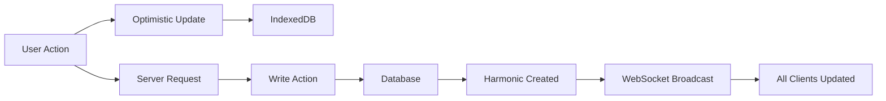

# Welcome to Laravel Chorus

**Laravel Chorus** is a real-time synchronization engine that seamlessly syncs subsets of your database to your users' devices, enabling lightning-fast user interfaces and robust offline capabilities.

## Why Choose Chorus?

<CardGroup cols={2}>
  <Card title="⚡ Instant User Experience" icon="bolt">
    Users see immediate feedback for all actions, eliminating loading states and creating native app-like experiences.
  </Card>
  <Card title="📱 Offline-First Architecture" icon="wifi">
    Full functionality even without internet connection. Changes sync automatically when back online.
  </Card>
  <Card title="🔄 Real-Time Synchronization" icon="arrows-rotate">
    Changes broadcast instantly to all connected clients using Laravel Reverb WebSockets.
  </Card>
  <Card title="🛡️ Secure by Design" icon="shield-check">
    Built-in data filtering, multi-tenant isolation, and server-side validation for all operations.
  </Card>
</CardGroup>

## Quick Start

Get up and running with Laravel Chorus in under 5 minutes:

<Steps>
  <Step title="Install the Package">
    ```bash
    composer require pixelsprout/laravel-chorus
    php artisan chorus:install
    ```
  </Step>
  <Step title="Add the Trait">
    ```php
    class Message extends Model
    {
        use Harmonics;
        
        protected $syncFields = [
            'id', 'body', 'user_id', 'created_at'
        ];
    }
    ```
  </Step>
  <Step title="Use in Frontend">
    ```tsx
    const { data: messages, create } = useTable('messages');
    
    // Instant UI updates with real-time sync
    await create(optimisticData, serverData);
    ```
  </Step>
</Steps>

## Key Features

<AccordionGroup>
  <Accordion title="Selective Synchronization" icon="filter">
    Choose exactly which models and fields to sync. Apply custom filters to control data scope per user.
  </Accordion>
  
  <Accordion title="Optimistic Updates" icon="forward">
    UI updates immediately before server confirmation, providing instant user feedback with automatic rollback on errors.
  </Accordion>
  
  <Accordion title="Multi-Tenant Support" icon="users">
    Built-in tenant isolation with channel prefixes ensures complete data separation between organizations.
  </Accordion>
  
  <Accordion title="Write Actions" icon="pen-tool">
    Server-side validation and business logic with support for offline writes and conflict resolution.
  </Accordion>
  
  <Accordion title="React Integration" icon="react">
    Powerful React hooks for effortless real-time data binding with TypeScript support.
  </Accordion>
</AccordionGroup>

## How Chorus Works



1. **User performs an action** (create, update, delete)
2. **UI updates instantly** using optimistic updates
3. **Request processed** by server-side Write Actions
4. **Change broadcasted** as a "harmonic" to all connected clients
5. **All clients sync** the change to their local IndexedDB

## Use Cases

Chorus is perfect for applications requiring instant user feedback and real-time collaboration:

- **Messaging and chat applications**
- **Collaborative editing tools**
- **Project management dashboards**
- **Real-time analytics interfaces**
- **Social media feeds**
- **E-commerce with live inventory**

## Next Steps

<CardGroup cols={2}>
  <Card title="What is Chorus?" href="/what-is-chorus" icon="question">
    Learn about the core concepts and benefits of using Chorus
  </Card>
  
  <Card title="Getting Started" href="/getting-started" icon="rocket">
    Install and configure Chorus in your Laravel application
  </Card>
  
  <Card title="React Integration" href="/integrations/react" icon="react">
    Build real-time React components with Chorus hooks
  </Card>
  
  <Card title="Core Concepts" href="/concepts/harmonics" icon="book">
    Deep dive into harmonics and the write path
  </Card>
</CardGroup>

---

Ready to transform your application's user experience? [Get started with Laravel Chorus](/getting-started) today!
