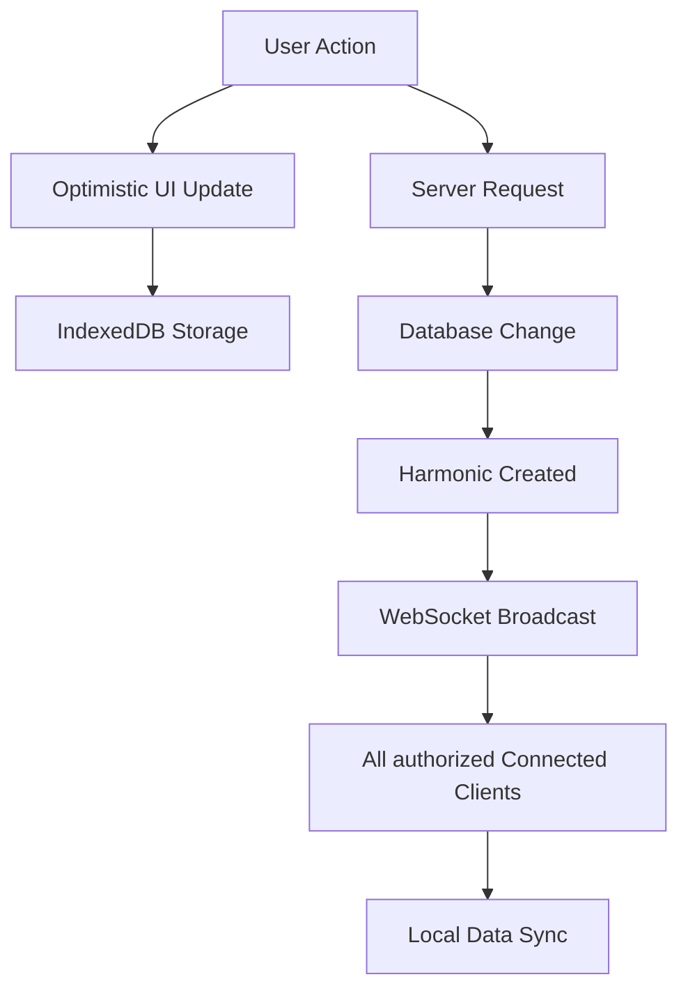

Laravel Chorus is a **real-time synchronization engine** designed specifically for Laravel applications. It seamlessly synchronizes subsets of your database to your users' devices, enabling lightning-fast user interfaces and robust offline capabilities.

## The Problem Chorus Solves

Traditional web applications require constant server round-trips for data operations, resulting in:
- **Slow user interfaces** with loading states for every action
- **Poor offline experience** when network connectivity is limited
- **Frustrating delays** that break the flow of user interactions
- **Complex state management** for real-time features

## The Chorus Solution

Chorus transforms your application by maintaining a **synchronized local copy** of relevant data on each client:

<CardGroup cols={2}>
<Card title="Instant Interactions" icon="bolt">
  UI updates immediately without waiting for server responses
</Card>

<Card title="Real-time Sync" icon="arrows-rotate">
  Changes broadcast instantly to all connected clients
</Card>

<Card title="Offline Support" icon="wifi">
  Full functionality even without internet connection
</Card>

<Card title="Secure by Design" icon="shield-check">
  Built-in data filtering and multi-tenant isolation
</Card>
</CardGroup>

## Key Features

**Selective Synchronization** - Choose exactly which models and fields to sync with custom filters and multi-tenant isolation.

**Real-time Broadcasting** - Powered by Laravel Reverb for instant WebSocket updates with efficient delta synchronization.

**Offline-First Architecture** - IndexedDB storage with optimistic updates, conflict resolution, and automatic sync when reconnected.

**Developer Experience** - Laravel-native implementation with simple trait-based configuration, React hooks, and TypeScript support.

## How It Works (Overview)

1. **User performs an action** (create, update, delete)
2. **UI updates instantly** using optimistic updates
3. **Request sent to server** in the background
4. **Server processes and stores** changes in database
5. **Change event (harmonic) created** and broadcast via WebSocket
6. **All connected clients receive** and apply the update
7. **Local IndexedDB synchronized** with server state

## Use Cases

Chorus is perfect for applications requiring instant user feedback and real-time collaboration: messaging platforms, collaborative editing tools, project management dashboards, real-time analytics, social feeds, and e-commerce with live inventory.

## Performance Benefits

<AccordionGroup>
<Accordion title="Instant User Experience">
Users see immediate feedback for all actions, eliminating frustrating loading states and creating a native app-like experience.
</Accordion>

<Accordion title="Reduced Server Load">
Fewer database queries as clients work with local data. Server only handles writes and change broadcasts.
</Accordion>

<Accordion title="Bandwidth Efficiency">
Only changes (deltas) are transmitted, not full datasets. Smart caching reduces redundant network requests.
</Accordion>

<Accordion title="Scalable Architecture">
WebSocket connections handle thousands of concurrent users efficiently. Local processing reduces server CPU load.
</Accordion>
</AccordionGroup>

## When to Use Chorus

**Perfect for** applications requiring real-time updates, Personal Apps, instant UI feedback, collaborative features, offline capabilities, and high-frequency user interactions.

**Not ideal for** simple CRUD applications, complex server-side business logic, or extremely sensitive data that shouldn't be cached locally.

---

Ready to get started? Check out our [Getting Started](/getting-started) guide to add real-time synchronization to your Laravel application.